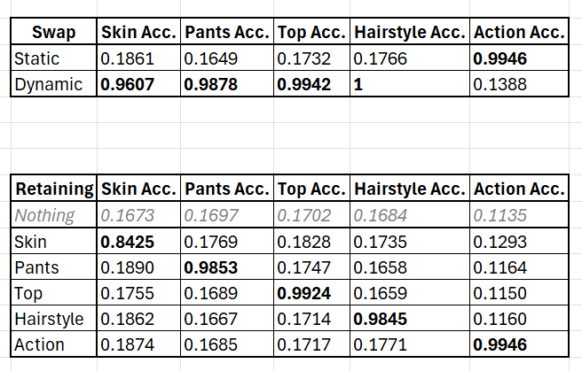
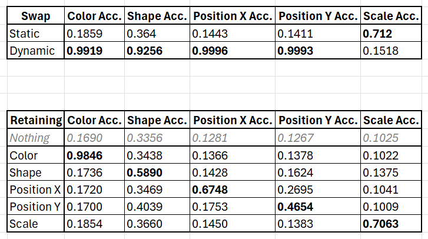
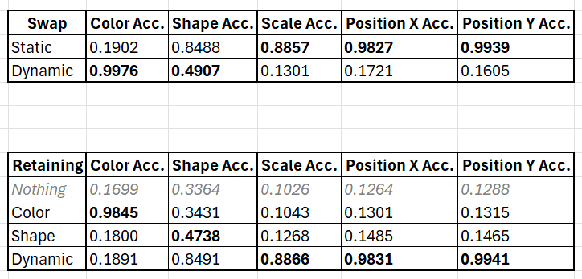
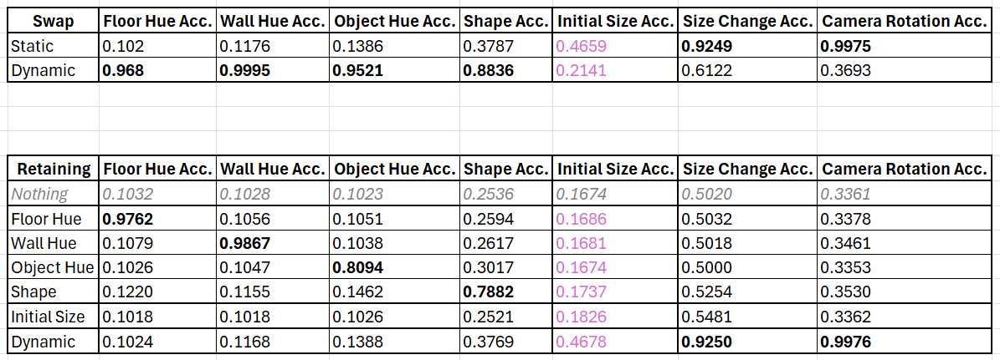

# How to use

1. Generate the dataset by following the instructions below.
2. Create (and activate) a new virtual environment which consists of the Python, pip, and package versions listed below.
3. (_For inference using the included pretrained models_) rename the `best_checkpoints` directory to `checkpoints`.
4. (_For inference using the included pretrained models_) set `train = 0` in `<dataset>.ini`.
5. Set the local `dataset_path` (with a trailing `/`) as well as your Neptune details in `<dataset>.ini`.
6. Add `./src` to `PYTHONPATH`.
7. Execute `python ./src/train.py --config-file <dataset>.ini`.

# Dataset generation

## Sprites

Generate using [Yingzhen Li's repository](https://github.com/YingzhenLi/Sprites), then export `X_train`, `X_test`, `A_train`, `A_test`, `D_train`, and `D_test`, which are returned by `sprites_act()` from Li's repo's `load_sprites.py`, to your local `dataset_path` as `sprites_X_train.npy`, `sprites_X_test.npy`, `sprites_A_train.npy`, `sprites_A_test.npy`, `sprites_D_train.npy`, and `sprites_D_test.npy`, respectively.

## dSprites

Generate using `./scripts/generate_dsprites_dataset.py` (first, set `DATA_IN` as the path to the local `dsprites_ndarray_co1sh3sc6or40x32y32_64x64.npz` from [Google DeepMind's repository](https://github.com/google-deepmind/dsprites-dataset), as well as `DATA_OUT` as your desired local `dataset_path`).

## Moving dSprites

Generate using `./scripts/generate_moving_dsprites_dataset.py` (first, set `DATA_IN` as the path to the local `dsprites_ndarray_co1sh3sc6or40x32y32_64x64.npz` from [Google DeepMind's repository](https://github.com/google-deepmind/dsprites-dataset), as well as `DATA_OUT` as your desired local `dataset_path`).

## 3D Shapes

Generate using [our MSD Benchmark repository](https://github.com/azencot-group/MSD-Benchmark).

# Original training environment details

| Detail                    | Sprites / dSprites                        | Moving dSprites                          | 3D Shapes                                          |
|---------------------------|-------------------------------------------|------------------------------------------|----------------------------------------------------|
| CPU                       | Intel(R) Xeon(R) CPU E5-1650 v4 @ 3.60GHz | AMD EPYC 7343 16-Core Processor          | Intel(R) Xeon(R) CPU E5-1650 v4 @ 3.60GHz          |
| CPU architecture          | x86_64                                    | x86_64                                   | x86_64                                             |
| Linux kernel version      | 5.14.0-427.18.1.el9_4.x86_64              | 5.14.0-427.20.1.el9_4.x86_64             | 5.14.0-427.18.1.el9_4.x86_64                       |
| glibc version             | 2.34                                      | 2.34                                     | 2.34                                               |
| GPU                       | NVIDIA GeForce RTX 3090 (Gigabyte Turbo)  | NVIDIA GeForce RTX 3090 (Gigabyte Turbo) | NVIDIA GeForce RTX 3090 (Innovision INNO3D Blower) |
| NVIDIA driver version     | 555.42.02                                 | 555.42.02                                | 555.42.02                                          |
| NVIDIA VBIOS version      | 94.02.26.08.1C                            | 94.02.42.40.34                           | 94.02.42.00.02                                     |
| CUDA version              | 12.1                                      | 12.1                                     | 12.1                                               |
| cuDNN version             | 8.9.2                                     | 8.9.2                                    | 8.9.2                                              |
| Python version            | 3.11.9                                    | 3.11.9                                   | 3.11.9                                             |
| pip version               | 24.0                                      | 24.0                                     | 24.0                                               |
| NumPy version             | 2.0.0                                     | 2.0.0                                    | 2.0.0                                              |
| PyTorch version           | 2.3.1                                     | 2.3.1                                    | 2.3.1                                              |
| PyTorch Lightning version | 2.3.0                                     | 2.3.0                                    | 2.3.0                                              |
| Python package versions   | `requirements-exact.txt`                  | `requirements-exact.txt`                 | `requirements-exact.txt`                           |

# Results

## Sprites

## dSprites

## Moving dSprites

## 3D Shapes

